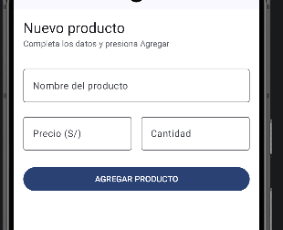
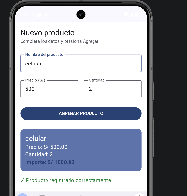

# RegistroDeProducto - Lab 03

**Desarrollado por:** Gonzalo

## Descripción
Esta aplicación permite registrar un producto ingresando su nombre, precio y cantidad. Al presionar el botón "AGREGAR PRODUCTO", se muestra un resumen con el importe total calculado y un mensaje de confirmación.

La aplicación utiliza **Jetpack Compose** y **Material 3**, aplicando jerarquía tipográfica y componentes como `OutlinedTextField`, `Button`, `Card` y `Scaffold`.

## Capturas de Pantalla

### 1. Pantalla Inicial (Vacía)

### 2. Producto Registrado

## Pregunta: ¿Qué pasaría si declaras las variables de los campos SIN remember?

Si se declaran las variables sin `remember` (por ejemplo: `var nombre = ""`), el estado no persistirá durante las **recomposiciones**. En cada redibujado de la pantalla, la variable volvería a su valor inicial y el usuario no podría escribir.

## Diferencia: remember vs rememberSaveable

En esta versión del código, hemos aplicado ambos para notar la diferencia:

1.  **`remember`**: Almacena el valor en la memoria del árbol de composición. Sobrevive a recomposiciones (cuando cambias el texto), pero **se pierde al girar la pantalla** (cambio de configuración) porque la Activity se recrea.
2.  **`rememberSaveable`**: Almacena el valor en un `Bundle`. Sobrevive tanto a recomposiciones como a **giros de pantalla**. Es la opción recomendada para formularios que no deben borrarse accidentalmente.

*En el código actual, el campo "Nombre" usa `remember` (se borra al girar) y los campos "Precio" y "Cantidad" usan `rememberSaveable` (se mantienen al girar).*

## Mejora con IA

| Prompt que usé | Qué generó Gemini | Qué acepté o corregí (y por qué) |
| :--- | :--- | :--- |
| "Agrega validación de campos vacíos (si falta un dato al presionar AGREGAR, mostrar un mensaje de error en rojo en lugar de la Card) y un botón Limpiar que vacíe el formulario en PantallaRegistro. No toques la lógica de cálculo del resumen." | Generó un estado `error`, validación simple `if (isBlank())`, un botón "Limpiar" que resetea las variables y un texto rojo para mostrar el error. | **Corregí:** Añadí validación numérica para precio y cantidad (`toDoubleOrNull`/`toIntOrNull`). La IA solo validaba campos vacíos, pero la app fallaba si se ingresaban letras. **Mejoré:** Cambié el estilo del error a una `Card` con `errorContainer` para que sea visualmente más profesional. |
