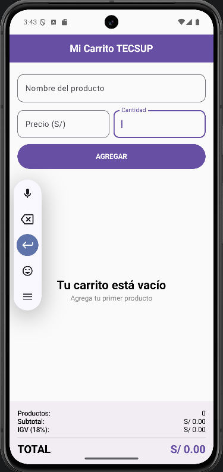
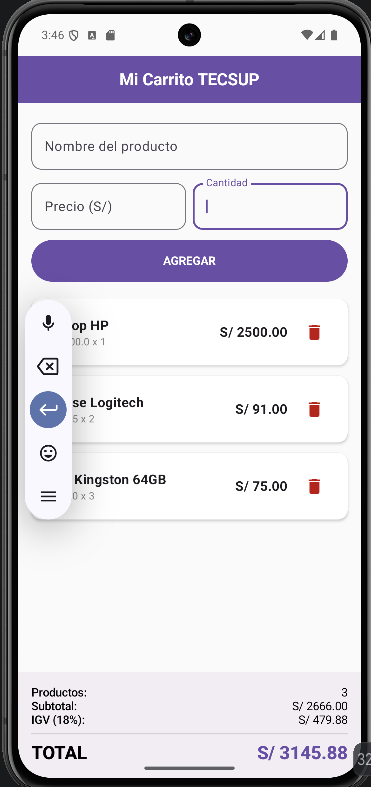

# Mi Carrito TECSUP - Laboratorio 04

**Nombre:** Gonzalo Dávila

## Descripción
Esta es una aplicación de carrito de compras desarrollada con **Kotlin** y **Jetpack Compose**. La aplicación permite registrar productos (nombre, precio y cantidad), visualizarlos en una lista dinámica, eliminar elementos individualmente y calcular automáticamente el subtotal, el IGV (18%) y el total general.

## Capturas de Pantalla

### 1. Carrito Vacío

### 2. Carrito con Productos

## Preguntas del Laboratorio

### a) ¿Por qué mutableStateListOf y no una MutableList normal?
Porque `mutableStateListOf` es una lista observable por Jetpack Compose. Cuando agregamos o eliminamos elementos, Compose detecta el cambio automáticamente y vuelve a dibujar (recomponer) la UI. Una `MutableList` normal no notifica a Compose, por lo que la lista en pantalla no se actualizaría aunque los datos cambien internamente.

### b) ¿Por qué la lista es val si podemos agregar y eliminar productos?
Porque `val` significa que la **referencia** a la lista no cambia (siempre es el mismo objeto lista), pero el **contenido** del objeto (los productos dentro) sí puede ser modificado mediante funciones como `.add()` o `.remove()`. No necesitamos reasignar la variable, solo alterar sus elementos.

### c) ¿Qué hace weight(1f) en la LazyColumn?
Hace que la `LazyColumn` se expanda para ocupar todo el espacio vertical disponible que sobra después de dibujar el formulario. Esto permite que el panel de totales se mantenga "empujado" al final de la pantalla, fijándolo en la parte inferior mientras la lista usa el resto del espacio.

---
**Instrucciones para imágenes:**
1. Crea una carpeta llamada `capturas` en la raíz del proyecto.
2. Guarda los pantallazos del emulador como `vacio.png` y `lleno.png` dentro de esa carpeta.
3. Al subir al repositorio, GitHub mostrará las imágenes automáticamente en el README.
